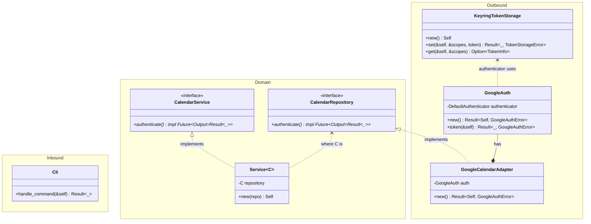

```mermaid
classDiagram
  direction BT

  namespace Inbound {
    class Cli {
      +handle_command(&self) Result~_~
    }
  }

  namespace Domain {
    class CalendarService {
      <<interface>>
      +authenticate()* impl Future~Output=Result~_~~
    }

    class CalendarRepository {
      <<interface>>
      +authenticate()* impl Future~Output=Result~_~~
    }

    class Service~C~ {
      -C repository
      +new(repo) Self
    }
  }

  namespace Outbound {
    class KeyringTokenStorage {
      +new() Self
      +set(&self, &scopes, token) Result~_, TokenStorageError~
      +get(&self, &scopes) Option~TokenInfo~
    }

    class GoogleAuth {
      -DefaultAuthenticator authenticator
      +new() Result~Self, GoogleAuthError~
      +token(&self) Result~_, GoogleAuthError~
    }

    class GoogleCalendarAdapter {
      -GoogleAuth auth
      +new() Result~Self, GoogleAuthError~
    }
  }

  Service~C~ ..|> CalendarService : implements
  Service~C~ ..> CalendarRepository : where C is

  GoogleAuth ..> KeyringTokenStorage : authenticator uses
  GoogleCalendarAdapter *-- GoogleAuth : has
  GoogleCalendarAdapter ..|> CalendarRepository : implements
```
