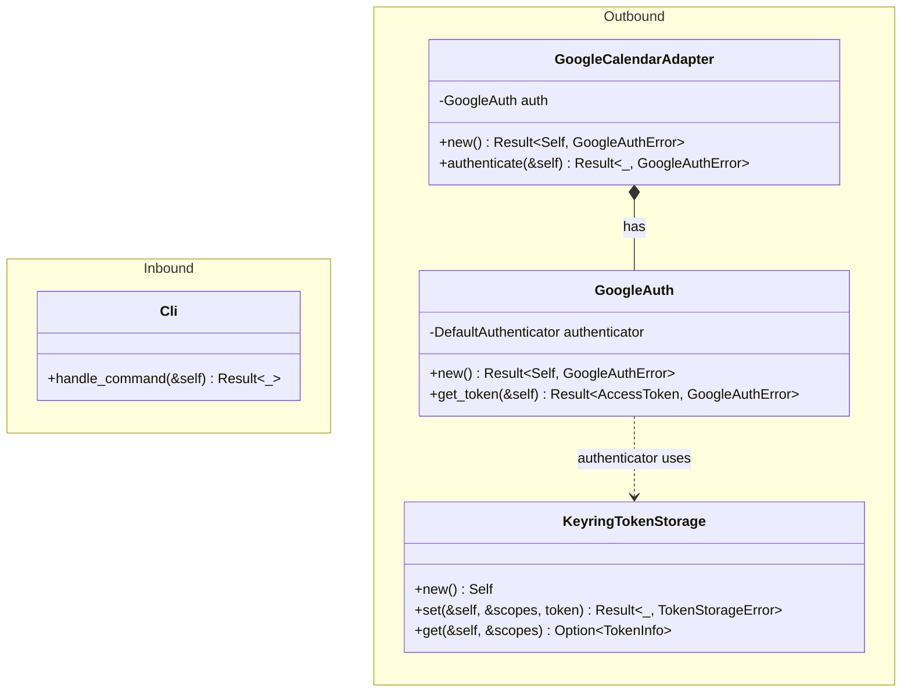

```mermaid
classDiagram
  direction BT

  namespace Inbound {
    class Cli {
      +handle_command(&self) Result~_~
    }
  }

  namespace Outbound {
    class KeyringTokenStorage {
      +new() Self
      +set(&self, &scopes, token) Result~_, TokenStorageError~
      +get(&self, &scopes) Option~TokenInfo~
    }

    class GoogleAuth {
      -DefaultAuthenticator authenticator
      +new() Result~Self, GoogleAuthError~
      +get_token(&self) Result~AccessToken, GoogleAuthError~
    }

    class GoogleCalendarAdapter {
      -GoogleAuth auth
      +new() Result~Self, GoogleAuthError~
      +authenticate(&self) Result~_, GoogleAuthError~
    }
  }

  GoogleAuth ..> KeyringTokenStorage : authenticator uses
  GoogleCalendarAdapter *-- GoogleAuth : has
```
