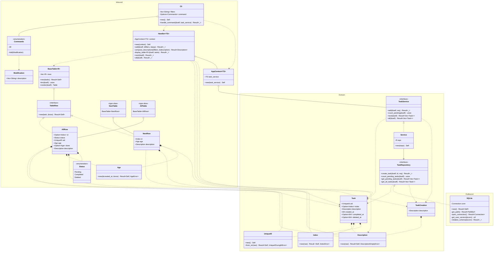

```mermaid
classDiagram
  AppContext~TS~ o-- TaskService
  Cli ..> AppContext~TS~
  Cli ..> Handler~TS~
  Cli o-- Commands
  Handler~TS~ o-- AppContext~TS~
  Handler~TS~ ..> Task
  Handler~TS~ ..> Description
  Commands ..> Modification
  namespace Inbound {
    class AppContext~TS~ {
      +TS task_service
      +new(task_service) Self
    }
    class Commands {
      <<enumeration>>
      -Add(Modification)
      -All
    }
    class Modification {
      +Vec~String~ description
    }
    class Handler~TS~ {
      -AppContext~TS~ context
      +new(context) Self
      +add(&self, &filters, &args) Result~_~
      -compose_description(&filters, &description) Result~Description~
      -display_table~R~(&self, tasks) Result~_~
      +next(&self) Result~_~
      +all(&self) Result~_~
    }
    class Cli {
      -Vec~String~ filters
      -Options~Commands~ command
      +new() Self
      +handle_command(&self, task_service) Result~_~
    }
    class Age {
      +new(&created_at, &now) Result~Self, AgeError~
    }
    class TableRow {
      <<interface>>
      +new(task, &now) Result~Self~
    }
    class NextRow {
      +Index id
      +Age age
      +Description description
    }
    class Status {
      <<enumeration>>
      Pending
      Completed
      Deleted
    }
    class AllRow {
      +Option~Index~ id
      +Status status
      +UniqueID uid
      +Age age
      +Option~Age~ done
      +Description description
    }
    class BaseTable~R~ {
      -Vec~R~ rows
      +new(tasks) Result~Self~
      +len(&self) usize
      +render(&self) Table
    }
    class NextTable {
      <<type alias>>
      BaseTable~NextRow~
    }
    class AllTable {
      <<type alias>>
      BaseTable~AllRow~
    }
  }
  Task *.. UniqueID
  Task *.. Index
  Task *.. Description
  TaskCreation *.. Description
  Handler~TS~ ..> TaskCreation
  TaskService ..> TaskCreation
  TaskRepository ..> TaskCreation
  TableRow <|.. NextRow
  TableRow <|.. AllRow
  NextRow *.. Index
  NextRow *.. Age
  NextRow *.. Description
  NextRow ..> Task
  AllRow *.. Status
  AllRow *.. UniqueID
  AllRow *.. Age
  AllRow *.. Description
  AllRow ..> Task
  BaseTable~R~ o-- TableRow
  NextTable o-- NextRow
  AllTable o-- AllRow
  Handler~TS~ ..> BaseTable~R~
  TaskService <|.. Service
  Service~R~ --> TaskRepository
  TaskRepository <|.. SQLite
  TaskService ..> Task
  TaskRepository ..> Task
  namespace Domain {
    class Description {
      +new(raw) Result~Self, DescriptionEmptyError~
    }
    class UniqueID {
      +new() Self
      +from_str(raw) Result~Self, UniqueIDLengthError~
    }
    class Index {
      +new(raw) Result ~Self, IndexError~
    }
    class Task {
      +UniqueId uid
      +Option~Index~ index
      +Description description
      +i64 created_at
      +Option~i64~ completed_at
      +Option~i64~ deleted_at
    }
    class TaskCreation {
      +Description description
    }
    class TaskService {
      <<interface>>
      +add(&self, req) Result~_~
      +count_pending(&self) usize
      +next(&self) Result~Vec~Task~~
      +all(&self) Result~Vec~Task~~
    }
    class Service~R~ {
      -R repo
      +new(repo) Self
    }
    class TaskRepository {
      <<interface>>
      +create_task(&self, id, req) Result~_~
      +count_pending_tasks(&self) usize
      +get_pending_tasks(&self) Result~Vec~Task~~
      +get_all_tasks(&self) Result~Vec~Task~~
    }
  }
  namespace Outbound {
    class SQLite {
      -Connection conn
      +new() Result~Self~
      -get_path() Result~PathBuf~
      -open_connection() Result~Connection~
      -get_user_version(&conn) u8
      -initialize_schema(&conn) Result~_~
    }
  }
```
