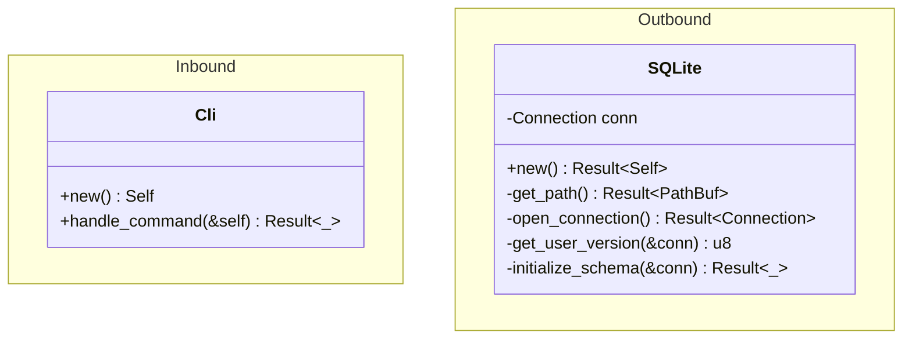

```mermaid
classDiagram
  namespace Inbound {
    class Cli {
      +new() Self
      +handle_command(&self) Result~_~
    }
  }
  namespace Outbound {
    class SQLite {
      -Connection conn
      +new() Result~Self~
      -get_path() Result~PathBuf~
      -open_connection() Result~Connection~
      -get_user_version(&conn) u8
      -initialize_schema(&conn) Result~_~
    }
  }
```
