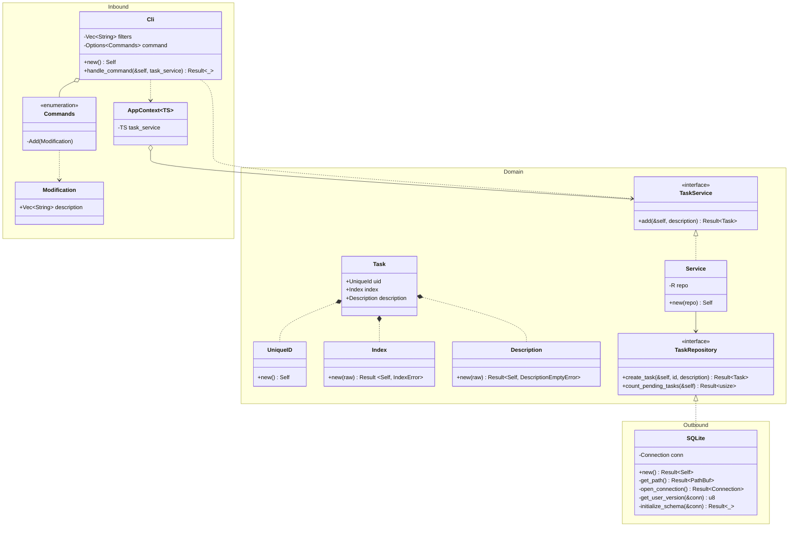

```mermaid
classDiagram
  AppContext~TS~ o-- TaskService
  Cli ..> AppContext~TS~
  Cli ..> TaskService
  Cli o-- Commands
  Commands ..> Modification
  namespace Inbound {
    class AppContext~TS~ {
      -TS task_service
    }
    class Commands {
      <<enumeration>>
      -Add(Modification)
    }
    class Modification {
      +Vec~String~ description
    }
    class Cli {
      -Vec~String~ filters
      -Options~Commands~ command
      +new() Self
      +handle_command(&self, task_service) Result~_~
    }
  }
  Task *.. UniqueID
  Task *.. Index
  Task *.. Description
  TaskService <|.. Service
  Service~R~ --> TaskRepository
  TaskRepository <|.. SQLite
  namespace Domain {
    class Description {
      +new(raw) Result~Self, DescriptionEmptyError~
    }
    class UniqueID {
      +new() Self
    }
    class Index {
      +new(raw) Result ~Self, IndexError~
    }
    class Task {
      +UniqueId uid
      +Index index
      +Description description
    }
    class TaskService {
      <<interface>>
      +add(&self, description) Result~Task~
    }
    class Service~R~ {
      -R repo
      +new(repo) Self
    }
    class TaskRepository {
      <<interface>>
      +create_task(&self, id, description) Result~Task~
      +count_pending_tasks(&self) Result~usize~
    }
  }
  namespace Outbound {
    class SQLite {
      -Connection conn
      +new() Result~Self~
      -get_path() Result~PathBuf~
      -open_connection() Result~Connection~
      -get_user_version(&conn) u8
      -initialize_schema(&conn) Result~_~
    }
  }
```
