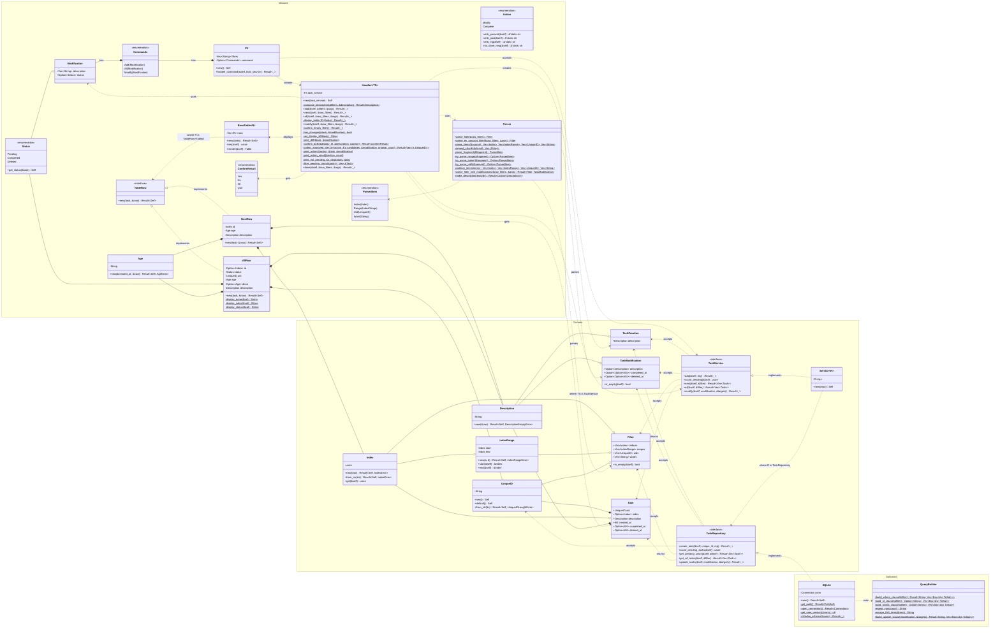

```mermaid
classDiagram
direction LR
  namespace Inbound {
    class Modification {
      +Vec~String~ description
      +Option~Status~ status
    }
    class Commands {
      <<enumeration>>
      Add(Modification)
      All(Modification)
      Modify(Modification)
    }
    class Cli {
      -Vec~String~ filters
      -Option~Commands~ command
      +new() Self
      +handle_command(&self, task_service) Result~_~
    }
    class Action {
      <<enumeration>>
      Modify
      Complete
      -verb_present(&self) &'static str
      -verb_past(&self) &'static str
      -verb_ing(&self) &'static str
      -not_done_msg(&self) &'static str
    }
    class ConfirmResult {
      <<enumeration>>
      Yes
      No
      All
      Quit
    }
    class Handler~TS~ {
      -TS task_service
      +new(task_service) Self
      -compose_description(&filters, &description)$ Result~Description~
      +add(&self, &filters, &args) Result~_~
      +next(&self, &raw_filters) Result~_~
      +all(&self, &raw_filters, &args) Result~_~
      -display_table~R~(tasks)$ Result~_~
      +modify(&self, &raw_filters, &args) Result~_~
      -confirm_empty_filter()$ Result~_~
      -has_changes(&task, &modification)$ bool
      -get_display_id(&task)$ String
      -print_diff(&task, &modification)$
      -confirm_bulk(&display_id, &description, &action)$ Result~ConfirmResult~
      -collect_approved_ids~'a~(action, &'a candidates, &modification, original_count)$ Result~Vec~'a UniqueID~~
      -print_action(&action, &task, &modification)$
      -print_action_result(&action, count)$
      -print_not_pending_for_ids(&tasks, &ids)$
      -filter_pending_tasks(&tasks)$ Vec~&Task~
      +done(&self, &raw_filters, &args) Result~_~
    }
    class ParsedItem {
      <<enumeration>>
      Index(Index)
      Range(IndexRange)
      Uid(UniqueID)
      Word(String)
    }
    class Parser {
      +parse_filter(&raw_filters)$ Filter
      +parse_en_passant_filter(&raw_filters, &args)$ Filter
      -parse_items(&source)$ Vec~Index~, Vec~IndexRange~, Vec~UniqueID~, Vec~String~
      -expand_chunk(&chunk)$ Vec~String~
      -parse_fragment(&fragment)$ ParsedItem
      -try_parse_range(&fragment)$ Option~ParsedItem~
      -try_parse_index(&fragment)$ Option~ParsedItem~
      -try_parse_uid(&fragment)$ Option~ParsedItem~
      -partition_items(items)$ Vec~Index~, Vec~IndexRange~, Vec~UniqueID~, Vec~String~
      +parse_filter_with_modifications(&raw_filters, &args)$ Result~Filter, TaskModification~
      -make_description(&words)$ Result~Option~Description~~
    }
    class TableRow {
      <<interface>>
      +new(task, &now)* Result~Self~
    }
    class BaseTable~R~ {
      -Vec~R~ rows
      +new(tasks) Result~Self~
      +len(&self) usize
      +render(&self) Table
    }
    class NextRow {
      -Index id
      -Age age
      -Description description
      +new(task, &now) Result~Self~
    }
    class Age {
      -String
      +new(&created_at, &now) Result~Self, AgeError~
    }
    class AllRow {
      -Option~Index~ id
      -Status status
      -UniqueID uid
      -Age age
      -Option~Age~ done
      -Description description
      +new(task, &now) Result~Self~
      -display_done(&val)$ String
      -display_index(&val)$ String
      -display_status(&val)$ String
    }
    class Status {
      <<enumeration>>
      Pending
      Completed
      Deleted
      +get_status(&task) Self
    }
  }

  namespace Domain {
    class TaskService {
      <<interface>>
      +add(&self, req)* Result~_~
      +count_pending(&self)* usize
      +next(&self, &filter)* Result~Vec~Task~~
      +all(&self, &filter)* Result~Vec~Task~~
      +modify(&self, modification, &targets)* Result~_~
    }
    class Service~R~ {
      -R repo
      +new(repo) Self
    }
    class TaskRepository {
      <<interface>>
      +create_task(&self, unique_id, req)* Result~_~
      +count_pending_tasks(&self)* usize
      +get_pending_tasks(&self, &filter)* Result~Vec~Task~~
      +get_all_tasks(&self, &filter)* Result~Vec~Task~~
      +update_tasks(&self, modification, &targets)* Result~_~
    }

    class UniqueID {
      -String
      +new() Self
      +default() Self
      +from_str(&s) Result~Self, UniqueIDLengthError~
    }
    class Index {
      -usize
      +new(raw) Result~Self, IndexError~
      +from_str(&s) Result~Self, IndexError~
      +get(&self) usize
    }
    class Description {
      -String
      +new(&raw) Result~Self, DescriptionEmptyError~
    }
    class TaskCreation {
      +Description description
    }
    class TaskModification {
      +Option~Description~ description
      +Option~Option~i64~~ completed_at
      +Option~Option~i64~~ deleted_at
      +is_empty(&self) bool
    }
    class IndexRange {
      -Index start
      -Index end
      +new(a, b) Result~Self, IndexRangeError~
      +start(&self) &Index
      +end(&self) &Index
    }
    class Filter {
      +Vec~Index~ indices
      +Vec~IndexRange~ ranges
      +Vec~UniqueID~ uids
      +Vec~String~ words
      +is_empty(&self) bool
    }
    class Task {
      +UniqueID uid
      +Option~Index~ index
      +Description description
      +i64 created_at
      +Option~i64~ completed_at
      +Option~i64~ deleted_at
    }
  }

  namespace Outbound {
    class SQLite {
      -Connection conn
      +new() Result~Self~
      -get_path()$ Result~PathBuf~
      -open_connection()$ Result~Connection~
      -get_user_version(&conn)$ u8
      -initialize_schema(&conn)$ Result~_~
    }
    class QueryBuilder {
      +build_where_clause(&filter)$ Result~String, Vec&lt;Box&lt;dyn ToSql&gt;&gt;~
      -build_id_clause(&filter)$ Option~String~, Vec~Box~dyn ToSql~~
      -build_words_clause(&filter)$ Option~String~, Vec~Box~dyn ToSql~~
      -repeat_vars(count)$ String
      -escape_fts5_term(&term)$ String
      +build_update_clause(modification, &targets)$ Result~String, Vec&lt;Box&lt;dyn ToSql&gt;&gt;~
    }
  }

  Status --o Modification
  Modification --* Commands : has
  Commands --* Cli : has
  Cli ..> Handler~TS~ : creates
  Modification <.. Handler~TS~ : uses
  Cli ..> TaskService : accepts
  Handler~TS~ ..> Parser : uses
  ParsedItem <.. Parser
  BaseTable~R~ <.. Handler~TS~ : displays
  ConfirmResult <.. Handler~TS~ : gets

  TableRow <.. BaseTable~R~ : where R is TableRow+Tabled
  TableRow <|.. NextRow : implements
  TableRow <|.. AllRow : implements
  Age --* NextRow
  NextRow *-- Description
  NextRow *-- Index
  Status --* AllRow
  Age --* AllRow
  AllRow *-- UniqueID
  AllRow *-- Description

  Description --o TaskCreation
  Description --o TaskModification
  Index --o IndexRange
  Index --o Filter
  IndexRange --o Filter
  UniqueID --o Filter
  UniqueID --* Task
  Index --o Task
  Description --* Task

  Handler~TS~ ..> TaskCreation : creates
  TaskCreation <.. TaskService : accepts
  TaskModification <.. TaskService : accepts
  TaskCreation <.. TaskRepository : accepts
  TaskModification <.. TaskRepository : accepts
  UniqueID <.. TaskRepository : accepts
  Parser ..> Filter : parses
  Parser ..> TaskModification : parses
  Filter <.. TaskService : accepts
  Filter <.. TaskRepository : accepts
  Task <.. TaskRepository : returns
  Task <.. TaskService : returns
  Handler~TS~ ..> Task : gets

  TaskService <|.. Service~R~ : implements
  Handler~TS~ ..> TaskService : where TS is TaskService
  TaskRepository <|.. SQLite : implements
  TaskRepository <.. Service~R~ : where R is TaskRepository

  SQLite ..> QueryBuilder : uses
```
