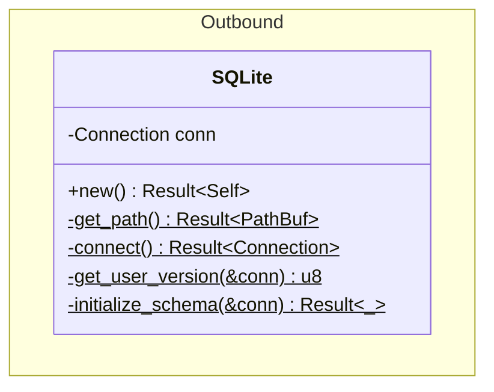

```mermaid
classDiagram
  namespace Outbound {
    class SQLite {
      -Connection conn
      +new() Result~Self~
      -get_path()$ Result~PathBuf~
      -connect()$ Result~Connection~
      -get_user_version(&conn)$ u8
      -initialize_schema(&conn)$ Result~_~
    }
  }
```
