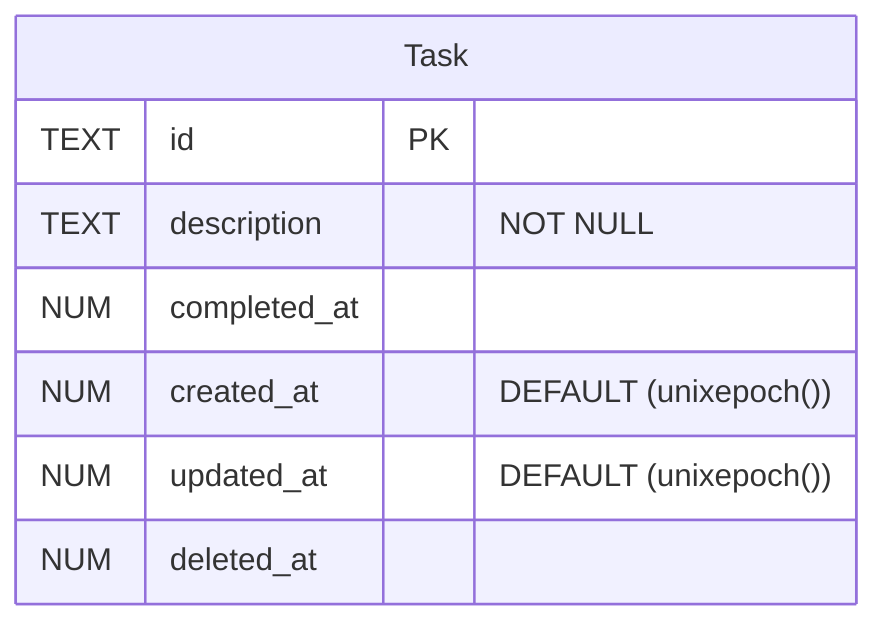

```mermaid
erDiagram
  Task {
    TEXT id PK
    TEXT description "NOT NULL"
    NUM completed_at
    NUM created_at "DEFAULT (unixepoch())"
    NUM updated_at "DEFAULT (unixepoch())"
    NUM deleted_at
  }
```
