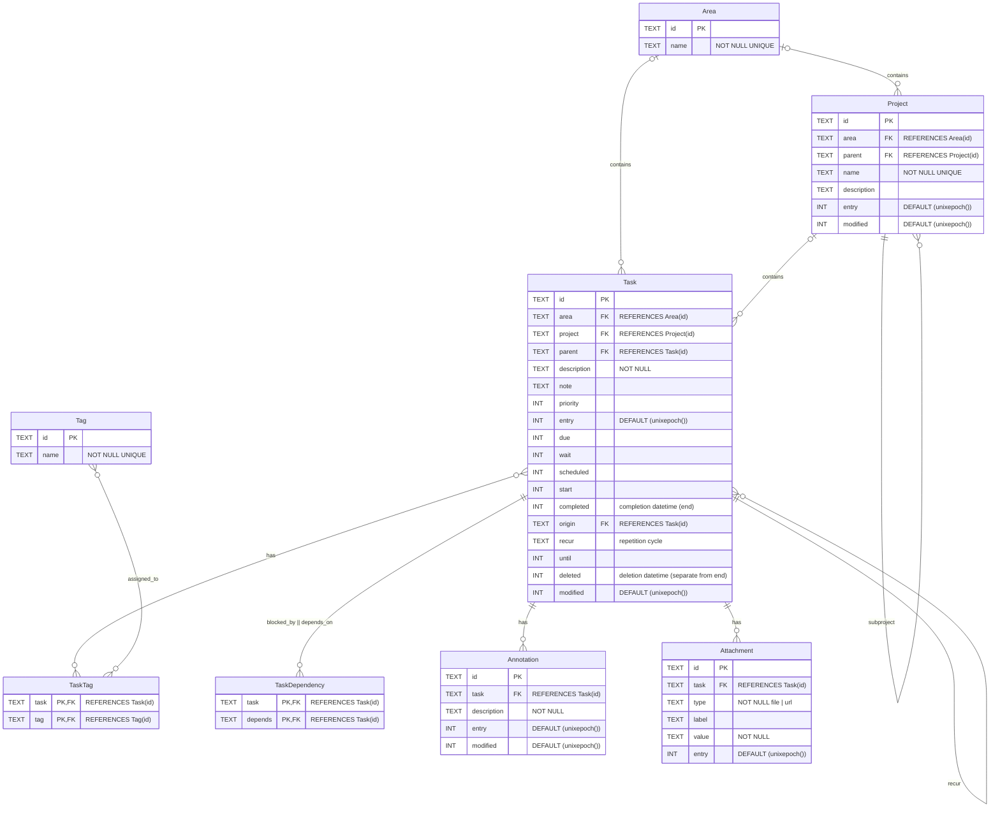

```mermaid
erDiagram
  Area |o--o{ Project : contains
  Area |o--o{ Task : contains
  Area {
    TEXT id PK
    TEXT name "NOT NULL UNIQUE"
  }

  Project |o--o{ Task : contains
  Project ||--o{ Project : subproject
  Project {
    TEXT id PK
    TEXT area FK "REFERENCES Area(id)"
    TEXT parent FK "REFERENCES Project(id)"
    TEXT name "NOT NULL UNIQUE"
    TEXT description
    INT entry "DEFAULT (unixepoch())"
    INT modified "DEFAULT (unixepoch())"
  }

  Task }o--o{ TaskTag : has
  Task ||--o{ Task : subtask
  Task ||--o{ Task : recur
  Task ||--o{ TaskDependency : "blocked_by || depends_on"
  Task ||--o{ Annotation : has
  Task ||--o{ Attachment : has
  Task {
    TEXT id PK
    TEXT area FK "REFERENCES Area(id)"
    TEXT project FK "REFERENCES Project(id)"
    TEXT parent FK "REFERENCES Task(id)"
    TEXT description "NOT NULL"
    TEXT note
    INT priority
    INT entry "DEFAULT (unixepoch())"
    INT due
    INT wait
    INT scheduled
    INT start
    INT completed "completion datetime (end)"
    TEXT origin FK "REFERENCES Task(id)"
    TEXT recur "repetition cycle"
    INT until
    INT deleted "deletion datetime (separate from end)"
    INT modified "DEFAULT (unixepoch())"
  }

  Tag }o--o{ TaskTag : assigned_to
  Tag {
    TEXT id PK
    TEXT name "NOT NULL UNIQUE"
  }

  TaskTag {
    TEXT task PK,FK "REFERENCES Task(id)"
    TEXT tag PK,FK "REFERENCES Tag(id)"
  }

  TaskDependency {
    TEXT task PK,FK "REFERENCES Task(id)"
    TEXT depends PK,FK "REFERENCES Task(id)"
  }

  Annotation {
    TEXT id PK
    TEXT task FK "REFERENCES Task(id)"
    TEXT description "NOT NULL"
    INT entry "DEFAULT (unixepoch())"
    INT modified "DEFAULT (unixepoch())"
  }

  Attachment {
    TEXT id PK
    TEXT task FK "REFERENCES Task(id)"
    TEXT type "NOT NULL file | url"
    TEXT label
    TEXT value "NOT NULL"
    INT entry "DEFAULT (unixepoch())"
  }
```
